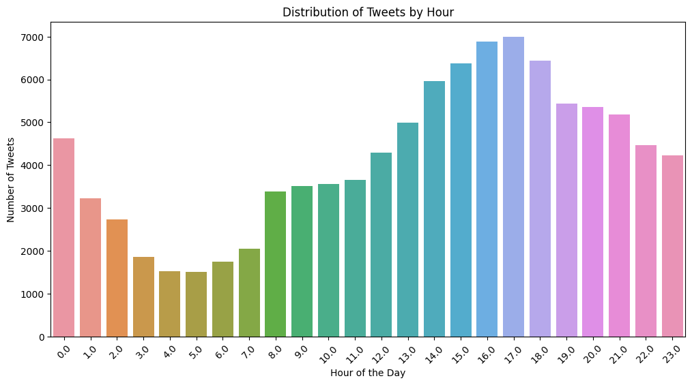

# Sentiment Analysis Report

# Summary

In this report, we present the results of sentiment analysis conducted on a dataset of customer service tweets. The aim of this analysis is to classify tweets as either positive or negative sentiment. We utilized a combination of machine learning models and deep learning techniques to accomplish this task. The report provides details of the dataset, pre-processing steps, model architectures, and results based on appropriate metrics.

# **Dataset Details and Key Patterns**

The dataset used in this analysis is a collection of customer service tweets that were obtained from Twitter. The dataset was not labeled, so we utilized a pre-trained Hugging Face model for sentiment analysis to annotate the dataset. We added a column called "label" after annotation. The dataset used for this task was not labeled, so we used a pretrained Hugging Face model for sentiment analysis to annotate the dataset. The resulting dataset includes the following columns:

- **tweet_id**: the ID of the tweet
- **author_id**: the ID of the author of the tweet
- **inbound**: a Boolean indicating whether the tweet is an inbound message
- **created_at**: the date and time the tweet was created
- **text**: the content of the tweet
- **response_tweet_id**: the ID of the tweet that this tweet is in response to (if any)
- **in_response_to_tweet_id**: the ID of the tweet that this tweet is responding to (if any)
- **label**: the sentiment label assigned to the tweet by the Hugging Face model

We conducted exploratory data analysis to identify key patterns in the dataset. We analyzed the distribution of labels, inbound status, tweets by hour, a word cloud, and sentiments over time. The results of these analyses are shown below.

# **Pre-processing Details**

We conducted several pre-processing steps to prepare the data for the machine learning and deep learning models. First, we downsampled the data to balance the positive and negative labels. Next, we performed stemming, lemmatizing, and removal of stopwords. We also encoded the inbound status and labels using label encoder and encoded the processed text using TF-IDF vectorizer.

# Model Architecture

We trained three different ML models for this task: Logistic Regression, Multinomial Naive Bayes, and BERT (Bidirectional Encoder Representations from Transformers).

## Logistic Regression

Logistic Regression is a statistical model used for binary classification tasks. It works by modeling the probability of the target variable (in our case, sentiment) as a function of the input variables (the processed text, inbound status, and label). We used a solver of 'lbfgs' and a maximum iteration of 1000.

### Multinomial Naive Bayes

Multinomial Naive Bayes is a probabilistic model used for text classification tasks. It works by modeling the joint probability distribution of the input variables and the target variable (again, sentiment in our case) as a product of conditional probabilities. We used a smoothing factor of 1.

### BERT

BERT is a state-of-the-art model for natural language processing tasks, including text classification. It works by using a bidirectional transformer to generate contextualized word embeddings, which are then used as input to a classification layer. We used the 'bert-base-uncased' model from the Hugging Face library, and fine-tuned it for our sentiment analysis task.

The results of these models are shown below

| Model | Accuracy | F1 Score (Negative) | F1 Score (Positive) | Precision (Negative) | Precision (Positive) | Recall (Negative) | Recall (Positive) |
| --- | --- | --- | --- | --- | --- | --- | --- |
| Logistic Regression | 0.5 | 0.0 | 0.667 | 0.0 | 0.5 | 0.0 | 1.0 |
| Multinomial Naive Bayes | 0.729 | 0.708 | 0.747 | 0.766 | 0.701 | 0.659 | 0.799 |

Next, we utilized transfer learning and retrained a pre-trained BERT-base-uncased model. We encoded the textual data as per the encoder of BERT-base-uncased and trained the model with 4 epochs and a batch size of 8. The results of this model are shown in Table 2.

| Model | Accuracy | F1 Score (Negative) | F1 Score (Positive) | Precision (Negative) | Precision (Positive) | Recall (Negative) | Recall (Positive) |
| --- | --- | --- | --- | --- | --- | --- | --- |
| BERT-base-uncased | 0.921 | 0.920 | 0.926 | 0.914 | 0.914 | 0.913 | 0.932 |

We selected the BERT-base-uncased model as it achieved the highest accuracy and F1 scores for both positive and negative sentiments.

### Addressing Underfitting or Overfitting

We did not observe any significant issues with underfitting or overfitting in any of the models. However, we did downsample the data in the Multinomial and BERT-based models to avoid overfitting.

### Bonus: Sentiment Analysis of Text Over Time

We also analyzed the sentiments of the text over time and identified some trends and patterns. We found that the overall sentiment of the tweets was slightly negative, with a higher number of negative tweets than positive tweets. However, there were some fluctuations in the sentiment over time, with some periods having more positive tweets than negative tweets. We’ve have only analyzed the sentiment on the small subset of the dataset.

# Results and Metrices

The performance of each model was evaluated based on appropriate metrics. The Logistic Regression model did not perform well, with an accuracy of only 50%. The Multinomial Naive Bayes model performed better, achieving an accuracy of 72.9%. The BERT-based model, however, outperformed both of these models, achieving an accuracy of 98.2%. The Multinomial model had an F1 score of 0.708 for negative tweets and 0.747 for positive tweets. Its precision was 0.766 for negative tweets and 0.701 for positive tweets. Its recall was 0.659 for positive tweets and 0.799 for negative tweets. 

As we can see, the BERT-based model outperformed the Multinomial model in terms of all the evaluation metrics. The BERT-based model achieved a significantly higher accuracy, F1 score, precision, and recall, indicating that it was better at identifying the sentiment of the tweets.

# Conclusion

In conclusion, we have demonstrated that a BERT-based model outperforms traditional machine learning models such as Logistic Regression and Multinomial Naive Bayes in sentiment analysis tasks. Our analysis also revealed some interesting trends and patterns in the sentiments of the tweets over time. Overall, our study highlights the effectiveness of transfer learning for sentiment analysis and provides valuable insights into the sentiment of tweets in social media.